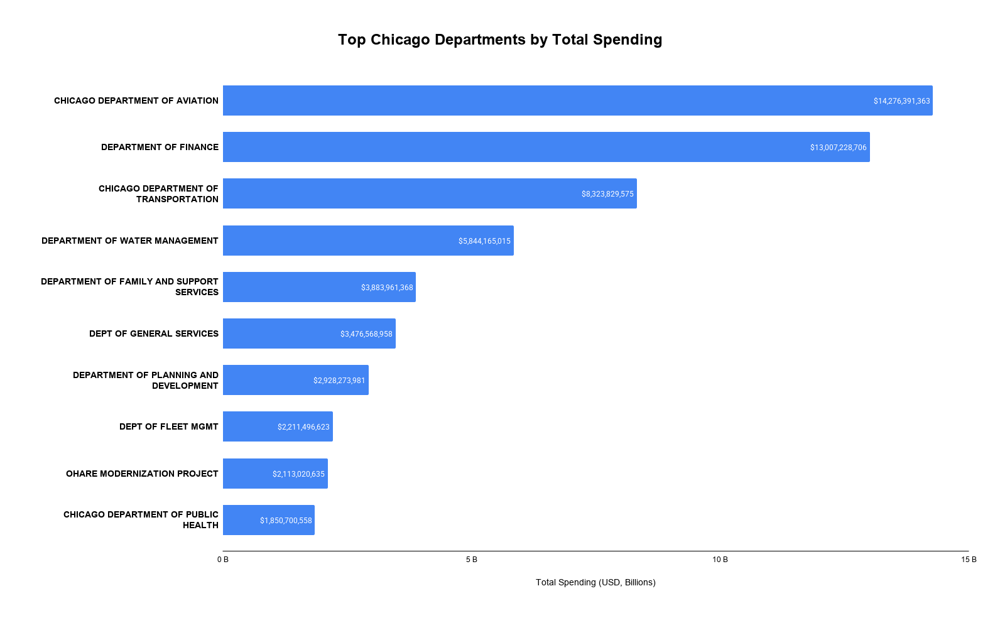
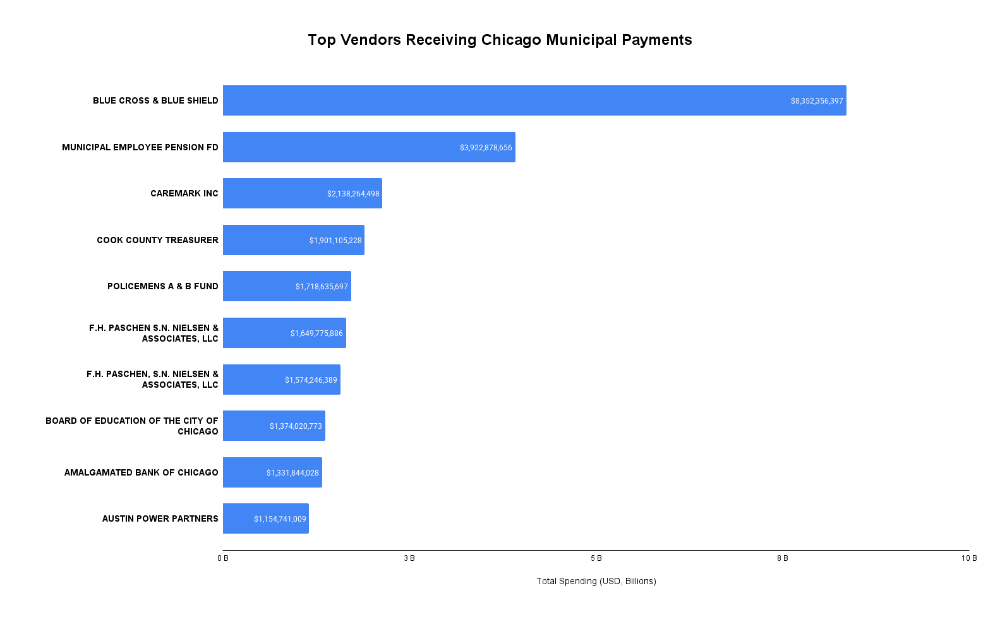
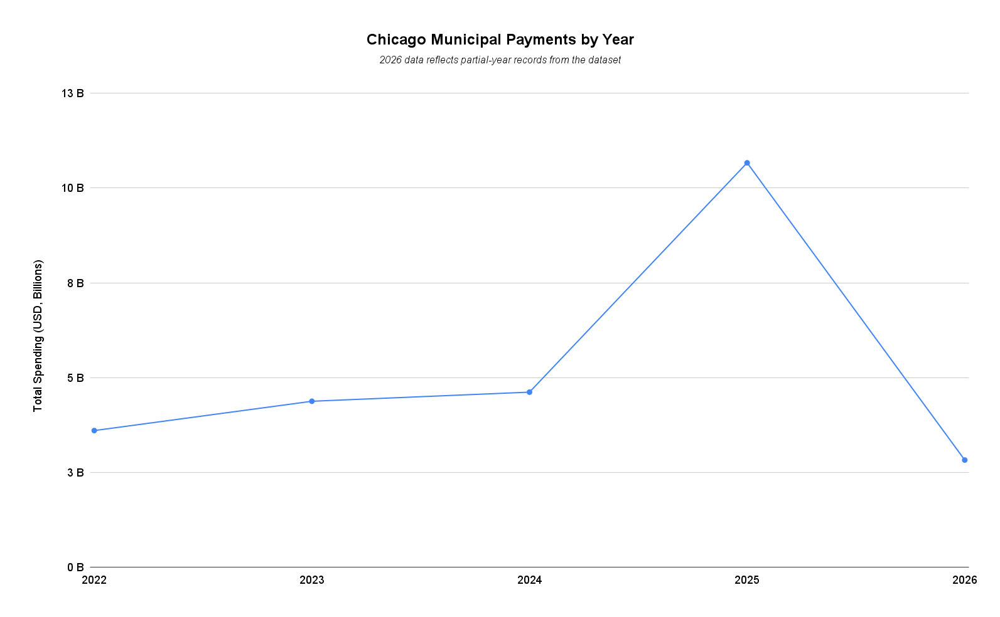

# Chicago Municipal Payments Analysis

## Project Overview

This project analyzes the **City of Chicago Payments dataset** using SQL in **Google BigQuery**.  
The goal was to explore municipal spending patterns, identify vendor concentration, and analyze departmental expenditures.

---

## Dataset

* **406,592 payment transactions**
* **63 city departments**
* **71,447 vendors**
* **$113.5 billion total spending**

Each record includes:

* Voucher number
* Payment amount
* Payment date
* Department issuing the payment
* Contract number
* Vendor name

---

## Methodology

The dataset was imported into **Google BigQuery** and analyzed using SQL.

Data preparation steps included:

* Cleaning column names
* Converting date fields
* Handling missing values

The analysis focused on:

* Total spending analysis
* Department spending distribution
* Vendor concentration
* Largest payments
* Spending trends over time

---

## Key Findings

### Department Concentration

The **top 5 departments account for approximately 40% of total municipal spending**.

Largest departments:

1. Chicago Department of Aviation
2. Department of Finance
3. Chicago Department of Transportation
4. Department of Water Management
5. Department of Family and Support Services

---

### Vendor Concentration

The **top 5 vendors receive approximately 15.9% of total city payments**.

Major vendors include:

* Blue Cross \& Blue Shield
* Municipal Employee Pension Fund
* Caremark Inc.
* Cook County Treasurer
* Policemen's Pension Fund

Healthcare providers and pension funds represent major financial obligations for the city.

---

### Largest Payments

The largest individual transactions exceed **$400 million**.

These payments were issued by the **Department of Finance** to **Blue Cross \& Blue Shield**, likely related to employee healthcare benefits.

---

### Spending Trends

Municipal spending increased gradually between **2022 and 2024**, followed by a significant spike in **2025**, which recorded the highest payment volume and total spending.

Data for **2026 appears incomplete**, likely reflecting partial-year reporting.

---

## Tools Used

* SQL
* Google BigQuery
* Public data from Chicago Open Data Portal

## Visualizations

### Top Departments by Spending

### Top Vendors by Payments

### Spending by Year

